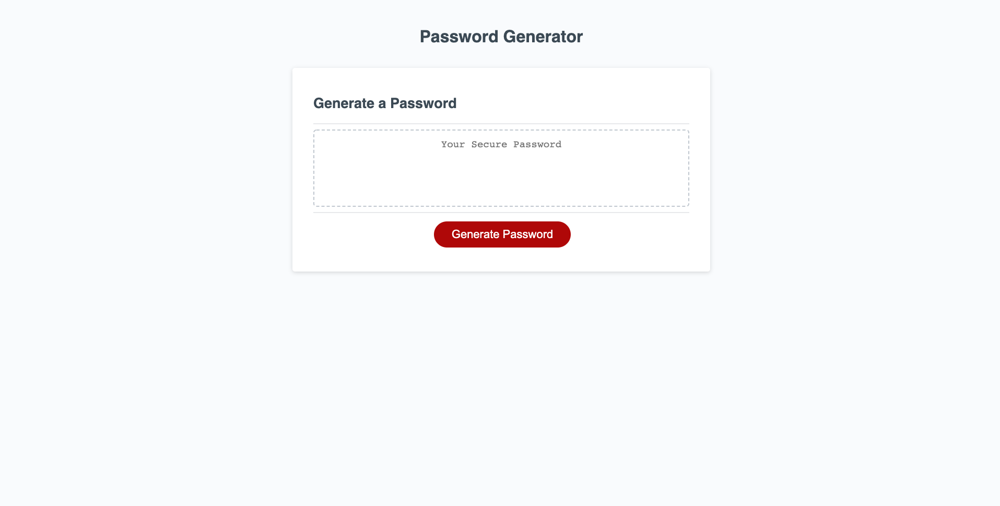

# Password-Generator

## Description

A password-generator, where the user chooses a password length between 8 and 128 characters. The user is then prompted to include (lowercase, uppercase, numbers or symbols) in the password. When the user has completed all the required elements to create a password then a random password will be genereated in the allocated box.

## What have we done

1- Created several functions for each character type.

2- The charCode has been used to choose randomly from the different characters found in the charCode.

3- Math.random and Math.floor has been used in order to randomise the selection of characters.

4-Alert messages have been included when for example the user chooses a password length more than 128 or less than 8.

## Screenshots

## Link to the deployed application

You can view the deployed application [here](https://hakki1810.github.io/Hakki-PasswordGenerator/).

## Link to the Github repository

You can access the Github repository [here](https://github.com/Hakki1810/Hakki-PasswordGenerator).
